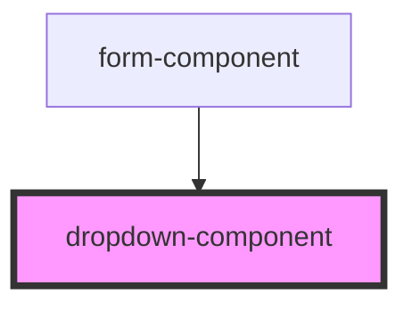

# dropdown-component

<!-- Auto Generated Below -->

## Properties

| Property        | Attribute        | Description | Type       | Default     |
| --------------- | ---------------- | ----------- | ---------- | ----------- |
| `label`         | `label`          |             | `string`   | `''`        |
| `name`          | `name`           |             | `string`   | `''`        |
| `options`       | --               |             | `string[]` | `undefined` |
| `selectedValue` | `selected-value` |             | `string`   | `undefined` |

## Events

| Event         | Description | Type                  |
| ------------- | ----------- | --------------------- |
| `valueChange` |             | `CustomEvent<string>` |

## Dependencies

### Used by

 - [form-component](../form-component)

### Graph

----------------------------------------------

*Built with [StencilJS](https://stenciljs.com/)*
