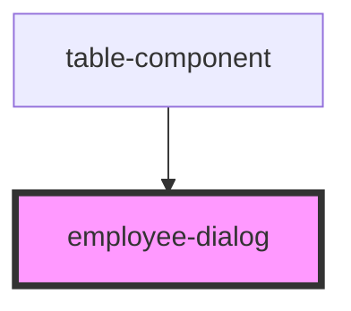

# employee-dialog

<!-- Auto Generated Below -->

## Properties

| Property       | Attribute       | Description | Type      | Default |
| -------------- | --------------- | ----------- | --------- | ------- |
| `employeeData` | `employee-data` |             | `any`     | `[]`    |
| `isOpen`       | `is-open`       |             | `boolean` | `false` |

## Events

| Event                 | Description | Type               |
| --------------------- | ----------- | ------------------ |
| `closeEmployeeDialog` |             | `CustomEvent<any>` |

## Dependencies

### Used by

 - [table-component](../table-component)

### Graph

----------------------------------------------

*Built with [StencilJS](https://stenciljs.com/)*
