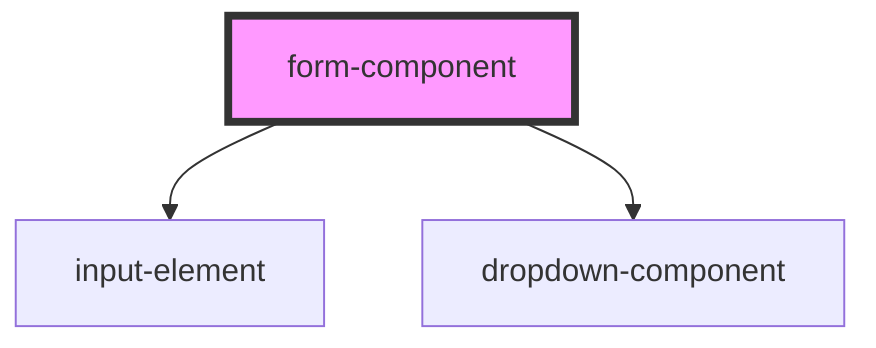

# form-component

<!-- Auto Generated Below -->

## Events

| Event              | Description | Type                 |
| ------------------ | ----------- | -------------------- |
| `sendEmployerData` |             | `CustomEvent<any[]>` |

## Dependencies

### Depends on

- [input-element](../input-element)
- [dropdown-component](../dropdown-component)

### Graph

----------------------------------------------

*Built with [StencilJS](https://stenciljs.com/)*
