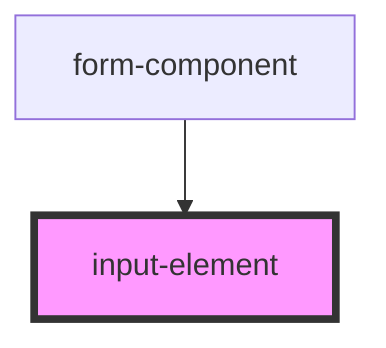

# input-element

<!-- Auto Generated Below -->

## Properties

| Property | Attribute | Description | Type  | Default     |
| -------- | --------- | ----------- | ----- | ----------- |
| `label`  | `label`   |             | `any` | `undefined` |
| `name`   | `name`    |             | `any` | `undefined` |
| `type`   | `type`    |             | `any` | `undefined` |
| `value`  | `value`   |             | `any` | `undefined` |

## Events

| Event          | Description | Type                                            |
| -------------- | ----------- | ----------------------------------------------- |
| `inputChanged` |             | `CustomEvent<{ name: string; value: string; }>` |

## Dependencies

### Used by

 - [form-component](../form-component)

### Graph

----------------------------------------------

*Built with [StencilJS](https://stenciljs.com/)*
