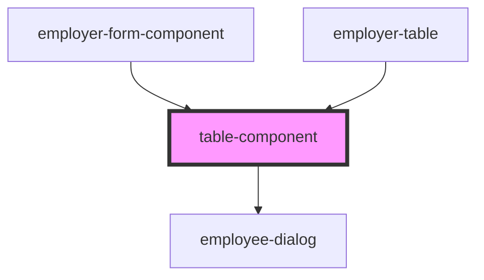

# table-component

<!-- Auto Generated Below -->

## Properties

| Property       | Attribute     | Description | Type      | Default |
| -------------- | ------------- | ----------- | --------- | ------- |
| `apiFeature`   | `api-feature` |             | `boolean` | `false` |
| `employerData` | --            |             | `any[]`   | `[]`    |

## Dependencies

### Used by

 - [employer-form-component](../employer-form-component)
 - [employer-table](../employer-table)

### Depends on

- [employee-dialog](../employee-dialog)

### Graph

----------------------------------------------

*Built with [StencilJS](https://stenciljs.com/)*
